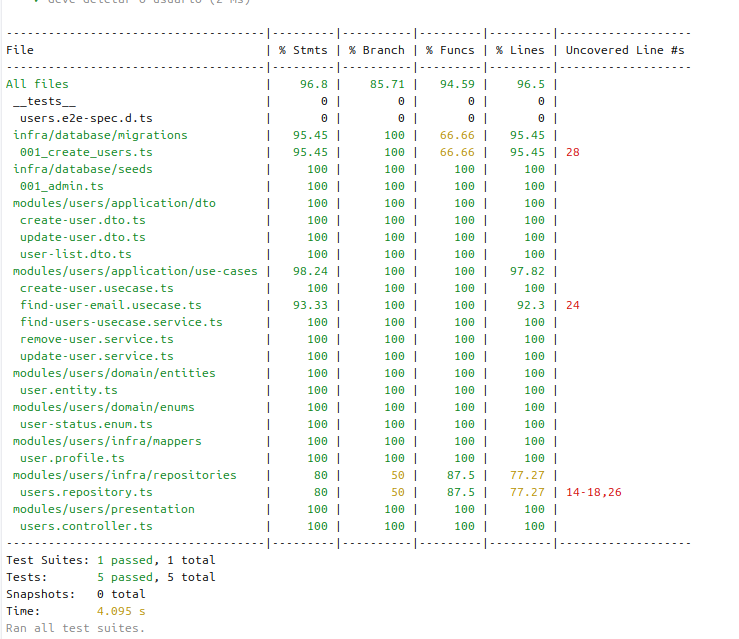

# Top Users Microservice

Microserviço **Top Users** responsável pelo gerenciamento de usuários da plataforma Top.

## Pré-requisitos

* Node.js >= 20
* NestJS
* Comunicação TCP (Dependente do Api Gateway https://github.com/Isaacs9/top-api-gateway)
* npm ou yarn
* Docker (para rodar banco PostgreSQL local ou via Testcontainers)

## Instalação

1. Clone o repositório:

```bash
git clone <url-do-repo-top-users>
cd top-users
```

2. Instale as dependências:

```bash
npm install
# ou
yarn install
```

3. Configure o `.env`:

Crie um arquivo `.env` na raiz do projeto com as seguintes variáveis:

```env
DB_CLIENT=pg
DB_HOST=localhost
DB_PORT=5432
DB_USER=postgres
DB_PASSWORD=postgres
DB_NAME=top_users
DB_SCHEMA=users
PORT=3001
```

> Ajuste as variáveis de acordo com seu ambiente.

## Rodando localmente

Para iniciar o microserviço:

```bash
npm run start:dev
# ou
yarn start:dev
```

O serviço ficará disponível em: `http://localhost:3001`

## Testes

### Testes unitários

```bash
npm run test
# ou
yarn test
```

### Testes de integração (e2e) com Testcontainers

```bash
npm run test:e2e
# ou
yarn test:e2e
```

> Os testes e2e usam um container PostgreSQL temporário via **Testcontainers**, garantindo isolamento do banco local.

### Cobertura de testes

Para gerar relatório de cobertura:

```bash
npm run test:cov
# ou
yarn test:cov
```

O relatório será gerado em `coverage/`.

Você pode ver o **print da cobertura** atual do projeto abaixo:



## Migrations

Para rodar migrations manualmente:

```bash
npm run migrate:run
```

Para rodar seeds manualmente:

```bash
npm run seed:run
```

Para reverter migrations:

```bash
npm run migrate:rollback
```

> Certifique-se de que o banco configurado no `.env` esteja disponível.

## Estrutura de diretórios sugerida

```
src/
 ├─ modules/
 │   └─ users/
 │       ├─ presentation/
 │       ├─ application/
 │       ├─ domain/
 │       └─ infra/
 ├─ infra/
 │   ├─ database/
 │   │   ├─ migrations/
 │   │   └─ seeds/
 │   └─ knexfile.ts
 ├─ auth/
 ├─ app.module.ts
 └─ main.ts
tests/
 ├─ unit/
 └─ e2e/
coverage/
 └─ (relatórios de cobertura)
docs/
 └─ coverage.png
```

## Observações

* O microserviço utiliza **NestJS**, **Knex** e **PostgreSQL**.
* Para testes e2e, o banco de testes é criado automaticamente em container via **Testcontainers**, garantindo isolamento do banco de produção.
* O schema padrão é `users`, configurável via variável `DB_SCHEMA`.
